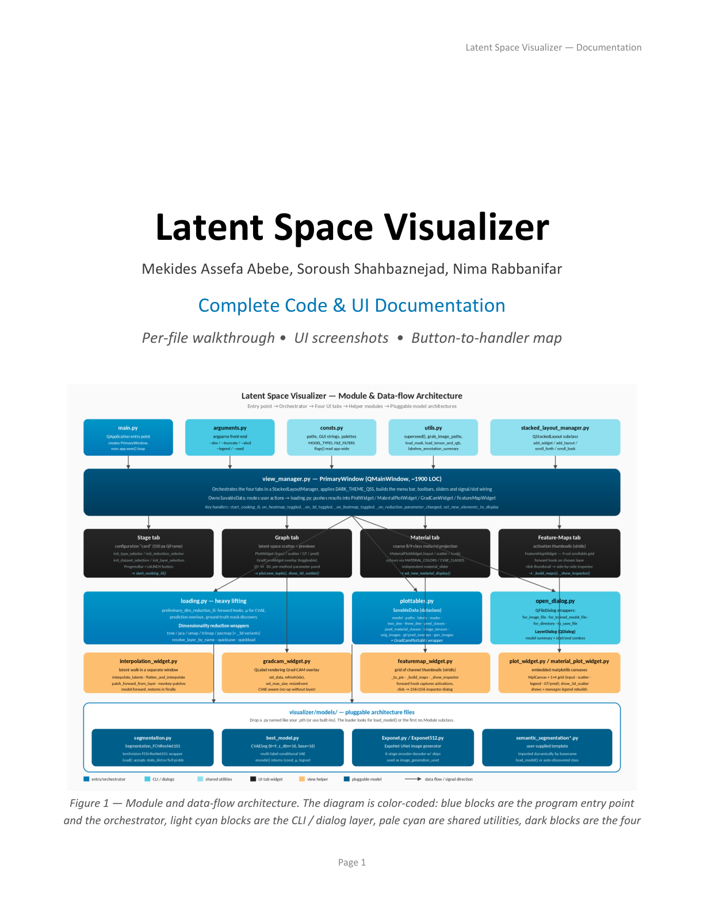
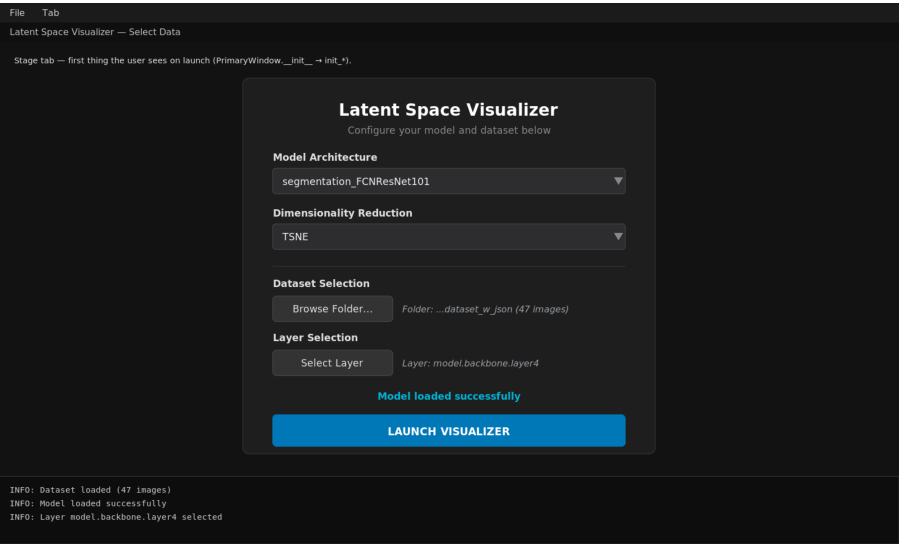
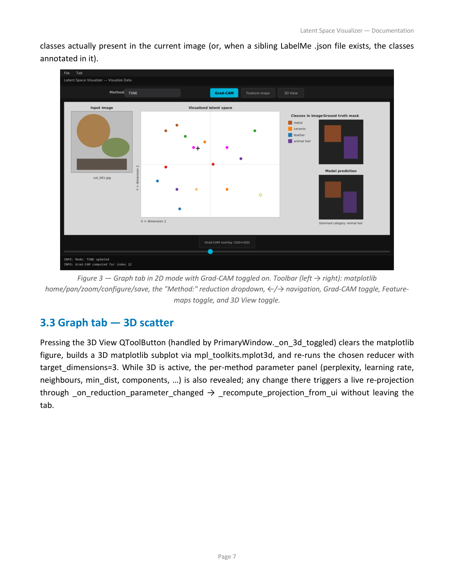
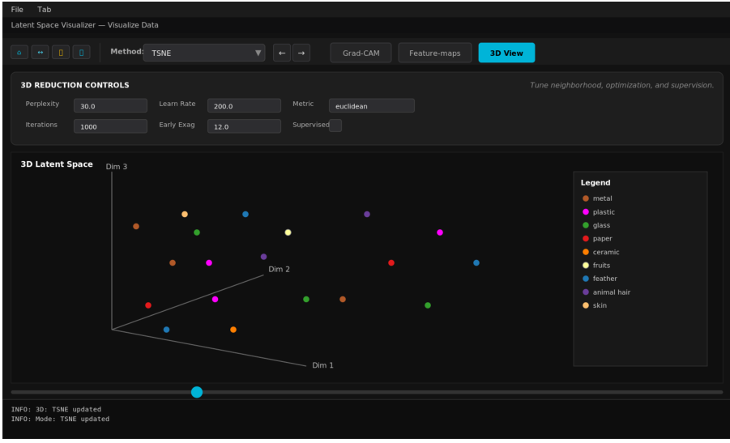
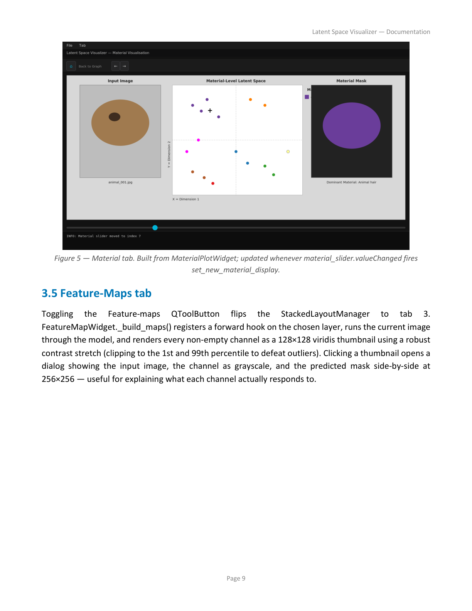
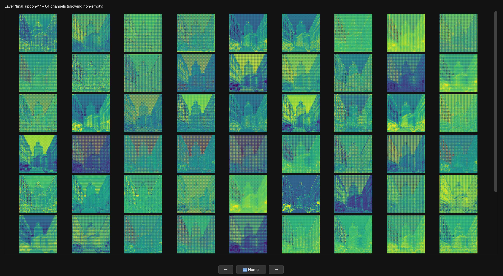
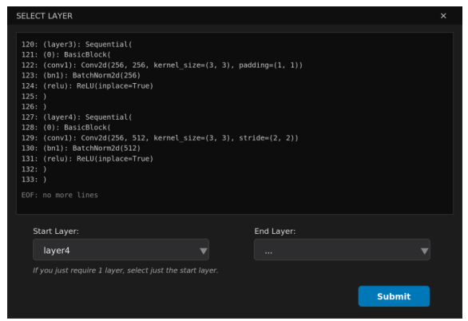
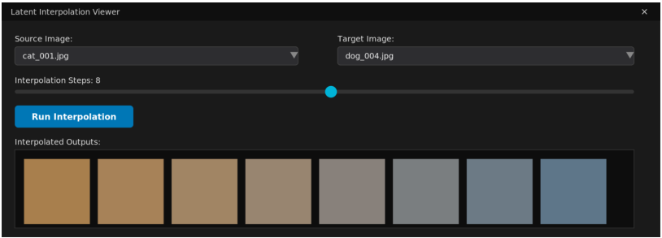

# Latent Space Visualizer

Interactive desktop visualization framework for exploring neural-network latent spaces, feature activations, segmentation predictions, and interpretable AI workflows.

---

## Overview

The **Latent Space Visualizer** is a PyQt6-based desktop application designed for interactive analysis of learned representations from PyTorch neural networks.

The framework enables researchers and developers to:

- Load trained `.pth` checkpoints
- Extract intermediate activations from selected layers
- Perform dimensionality reduction (t-SNE, PCA, UMAP, TRIMAP, PaCMAP)
- Visualize latent embeddings in 2D and 3D
- Inspect Grad-CAM saliency maps
- Explore feature-map activations channel-by-channel
- Compare predictions, masks, and material categories
- Perform latent-space interpolation between samples

The system was developed for research in:

- AI interpretability
- Computer vision
- Material appearance analysis
- Segmentation analysis
- Representation learning
- HDR and color imaging workflows

---

## Key Features

### Modular and Extendible GUI Framework
- PyQt6-based multi-tab desktop interface
- Easily extensible architecture
- Dynamic model loading
- Plug-and-play visualization modules

### Multiple Deep Learning Integration Pipelines
Supports integration with:
- Segmentation networks
- CNN feature extractors
- Conditional Variational Autoencoders (CVAE)
- U-Net image generators
- Custom PyTorch architectures

### Dimensionality Reduction
Built-in support for:
- t-SNE
- PCA
- UMAP
- TRIMAP
- PaCMAP

### Interactive Visualization
- 2D and 3D latent-space visualization
- Live parameter adjustment
- Interactive scatter exploration
- Sample-wise navigation

### Explainable AI Tools
- Grad-CAM visualization
- Feature-map exploration
- Channel-level inspection
- Layer-selection interface

### Dataset & Annotation Support
- LabelMe annotations
- Segmentation masks
- Multi-label material classes
- Ground-truth overlays

---

# System Workflow



The visualization workflow consists of:

1. Model loading
2. Dataset selection
3. Layer extraction
4. Feature computation
5. Dimensionality reduction
6. Interactive visualization
7. Explainability analysis

---

# User Interface

## Stage Tab — Configuration Interface



The Stage tab allows users to:

- Select model architectures
- Choose dimensionality reduction methods
- Select datasets
- Configure extraction layers
- Launch visualization workflows

---

## Graph Tab — 2D Latent Space



Interactive latent-space visualization with:

- Scatter plot exploration
- Input image preview
- Prediction overlays
- Ground-truth comparison
- Grad-CAM visualization

---

## Graph Tab — 3D Visualization



Features:
- Interactive 3D embeddings
- Live parameter tuning
- Dynamic reprojection
- Method-specific controls

---

## Material Visualization Tab



Provides:
- Coarse material clustering
- Material mask visualization
- Material-category projections

---

## Feature Maps Tab



Supports:
- Channel-wise activation visualization
- Feature-map inspection
- Interactive thumbnail exploration
- Layer interpretability analysis

---

## Layer Selection Dialog



The layer-selection dialog enables:
- Intermediate layer browsing
- Model structure inspection
- Feature extraction customization

---

## Latent Interpolation Viewer



Latent interpolation allows:
- Smooth transitions between samples
- Latent manifold exploration
- Decoder behavior analysis

---

# Built-in Model Types

| Model Type | Purpose |
|---|---|
| `image_generation_unet` | U-Net style image generation |
| `segmentation_FCNResNet101` | Semantic segmentation |
| `segmentation_CVAE` | Material segmentation with CVAE |

---

# Repository Structure

```text
visualizer/
├── main.py
├── view_manager.py
├── loading.py
├── plot_widget.py
├── material_plot_widget.py
├── featuremap_widget.py
├── gradcam_widget.py
├── interpolation_widget.py
├── models/
│   ├── segmentation.py
│   ├── best_model.py
│   ├── Exponet.py
│   └── Exponet512.py
└── tests/
```

---

# End-to-End Workflow

```text
Load Model
    ↓
Select Dataset
    ↓
Choose Layer
    ↓
Extract Features
    ↓
Apply Dimensionality Reduction
    ↓
Generate 2D/3D Projection
    ↓
Visualize & Explore
    ↓
Run Grad-CAM / Feature Analysis
```

---

# Technologies

- Python
- PyTorch
- PyQt6
- Matplotlib
- NumPy
- scikit-learn
- UMAP
- TRIMAP
- PaCMAP

---

# Research Applications

The framework is suitable for:

- AI explainability research
- Neural-network debugging
- Material appearance analysis
- Semantic segmentation analysis
- Latent-space exploration
- Representation-learning research
- HDR and color imaging studies

---

# Example Research Outputs

Related work includes:

- Color-aware segmentation analysis
- Deep-learning reconstruction of overexposed images
- Material segmentation and latent representation analysis
- Explainable visualization for neural networks

---

# Publications

- Mekides Assefa Abebe, Soroush Shahbaznejad, Alireza Rabbanifar, and Elena Fedorovskaya.  
  *Unveiling the Role of Color in Skin Segmentation: Analysis of Augmentation Techniques and Color Spaces.*  
  Journal of Imaging Science and Technology, 2025.

- Alireza Rabbanifar, Elena Fedorovskaya, Mekides Assefa Abebe.  
  *Performance Analysis of Deep Learning Architectures in Reconstruction of Overexposed Images.*  
  Color Imaging Conference, 2025.

- Soroush Shahbaznejad, Mekides Assefa Abebe, Alireza Rabbanifar, Michael J Murdoch.  
  *Analyzing the Impact of Color Spaces and Color Augmentation on Material Segmentation and Feature Representation.*  
  2026.

---

# Future Extensions

Potential future additions include:

- Diffusion-model latent analysis
- Vision transformer visualization
- Multi-modal embedding analysis
- Real-time inference support
- Web-based deployment
- Multi-GPU feature extraction

---

# Citation

If you use this framework in research, please cite the related publications and repository.

---

# License

Research and educational use.

