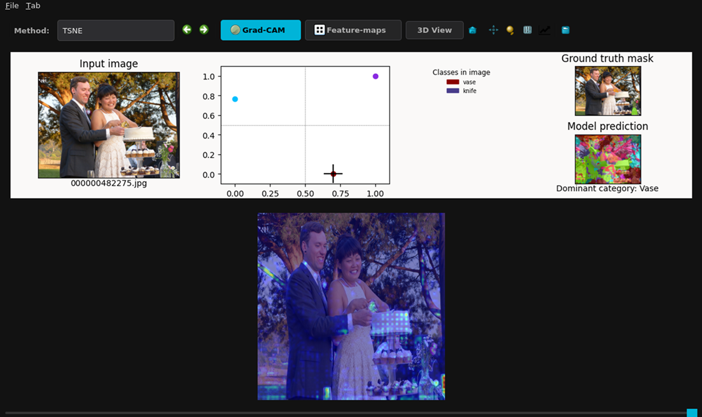
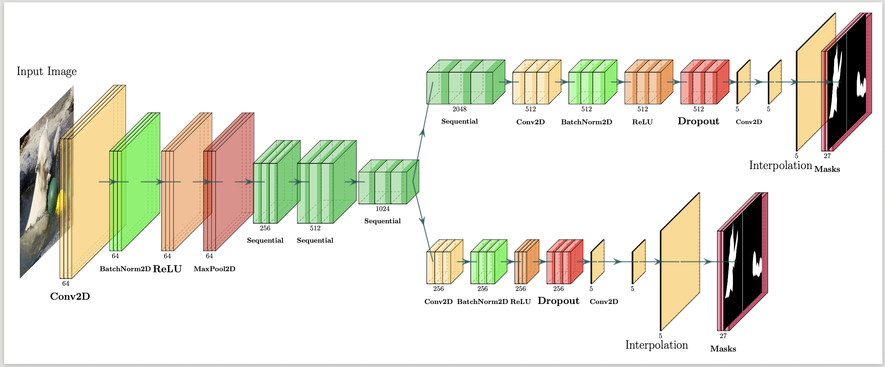
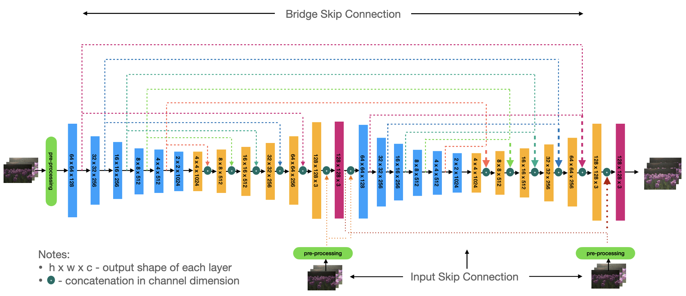
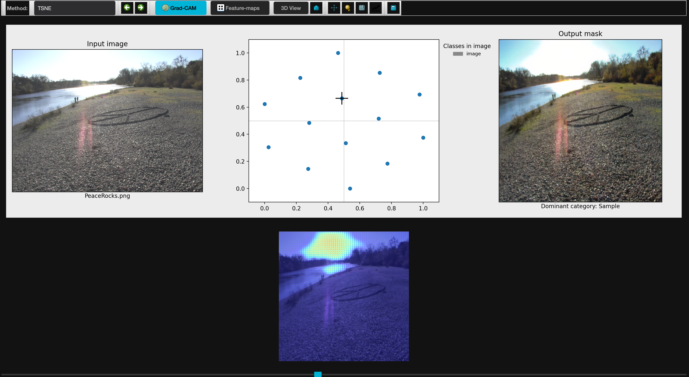
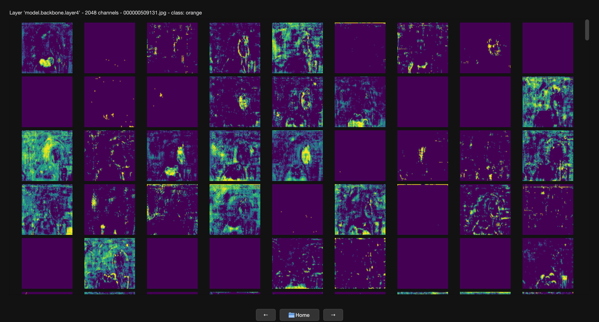

# Interactive DeepLearning Exploration tool

The Interactive Deep Learning Exploration Tool is an interactive desktop visualization framework designed for exploring neural-network latent spaces, feature activations, predictions, and interpretable AI workflows. Developed initially for color science and imaging research and teaching applications, the platform aims to address the growing challenges of understanding complex deep learning models, reducing coding barriers, and improving AI interpretability in educational and research environments, with future expansion planned toward neural science related applications. The main goal of the project is to provide an intuitive, hands-on environment that enables students and researchers to visualize, analyze, and better understand how deep learning models process and represent complex data across multidisciplinary domains.

---

## Overview

The Interactive Deep Learning Exploration Tool is a PyQt6-based desktop application designed for interactive visualization and analysis of learned representations from PyTorch-based neural networks. The framework aims to improve the interpretability and accessibility of deep learning models by providing an intuitive graphical environment for exploring different features of AI workflows without requiring extensive coding experience.

The visualizer currently enables researchers, students, and developers to:

- Load trained neural-network models from `.pth` checkpoints
- Extract and visualize intermediate activations from selected layers of CNN architectures
- Explore feature-map activations channel-by-channel to better understand learned spatial representations
- Perform dimensionality reduction on high-dimensional feature and latent spaces using methods such as PCA, t-SNE, and UMAP
- Visualize latent embeddings interactively in both 2D and 3D spaces
- Perform latent-space interpolation and traversal between samples to analyze learned feature continuity and representation behavior
- Inspect Grad-CAM saliency maps for interpretable AI analysis, with ongoing development toward additional attention-modeling and explainability visualizations
- Compare model outputs, predictions, and feature responses across different inputs and architectures

The framework is currently being developed and applied for research and educational applications in:

- Over-exposure correction and image generation workflows
- Material segmentation, classification, and appearance analysis
- Feature representation analysis for color science and imaging applications
- Ongoing work for time-series EEG analysis and other neural-science-related deep learning applications

The long-term goal of the project is to provide a modular and extensible visualization framework that supports interdisciplinary research and teaching across color science, imaging science, neural science, and interpretable AI applications.

---

## Key Features

### Modular and Extendible GUI Framework



The GUI is built as a PyQt6-based multi-tab desktop interface designed to support interactive exploration and visualization of deep learning models and their learned representations. The framework already includes several visualization, interactivity, and file-loading capabilities, allowing users to load trained neural-network checkpoints, inspect model outputs, visualize feature activations, explore latent spaces, and interact with visualizations through an intuitive graphical environment. The modular and extensible software architecture enables easy integration of additional visualization modules, model interfaces, explainability tools, and domain-specific analysis features, supporting future expansion toward broader imaging, computer vision, and neural-science-related applications.

### Multiple Deep Learning Integration Pipelines

The visualization tool is designed to support integration with multiple deep learning model architectures for interpretable AI exploration and analysis. The current implementation supports segmentation networks and UNet based autoencoder models developed for material appearance analysis and over-exposure correction applications. However, the same visualization and interpretability features can be applied to other tasks trained using similar architectures. The framework also provides an extensible mechanism for integrating additional CNN-based models by allowing users to supply their own model architectures, enabling broader adaptability across research applications. Future development plans include support for more advanced architectures such as Transformers, attention-based networks, and diffusion models.

#### Built-in Model Types

| Model Type | Purpose |
|---|---|
| `image_generation_unet` | U-Net style image generation |
| `segmentation_FCNResNet101` | Semantic segmentation |
| `segmentation_CVAE` | Material segmentation with CVAE |

#### Semantic segmentation Model Architecture


#### U-Net style image generation Model Architecture


---

### Dimensionality Reduction

Dimensionality reduction techniques are methods used to transform high-dimensional feature or latent representations learned by deep learning models into lower-dimensional spaces, such as 2D or 3D, while preserving important structural relationships within the data. In our visualization tool, dimensionality reduction enables users to visually explore complex feature distributions, clustering behavior, and latent-space organization, making it easier to interpret how neural networks represent different samples, classes, and learned patterns that would otherwise be impossible to observe directly in high-dimensional space.

Built-in support for:
- t-SNE
- PCA
- UMAP
- TRIMAP
- PaCMAP

### Interactive Visualization

Interactivity is a critical component of our visualization tool because it enables users to dynamically traverse through datasets, classes, model layers, and feature representations, select different visualization and interpretability methods, compare model outputs and activations, perform latent-space interpolations, and interactively explore complex neural-network behaviors in a more intuitive, transparent, and educational manner.

#### Current Interactivity Features

- Switching between 2D and 3D latent-space visualizations
- Live parameter adjustment and visualization updates
- Interactive scatter-plot exploration and sample selection
- Sample-wise dataset navigation
- Model layer-based navigation and feature inspection
- Interactive feature-map and activation exploration
- Comparative visualization of model outputs and representations

More interactivity features will be added.

### Explainable AI Tools

The framework intends to integrate several explainable AI and interpretability tools that help users better understand how neural networks process information, generate predictions, and learn internal feature representations.

- Grad-CAM visualization for highlighting spatial regions contributing to model predictions
- Feature-map exploration across intermediate network layers
- Channel-level activation inspection for detailed representation analysis
- Interactive visualization of learned feature responses and model behavior

Additional explainability, attention-modeling, and interpretability tools are planned for future integration.

### Dataset & Annotation Support

The framework includes support for loading, organizing, and visualizing datasets used in the supported deep learning models workflows, enabling easier integration between data preparation, model analysis, and interpretability tools.

- Segmentation and classification datasets with LabelMe-based annotation support
- Image generation, reconstruction, and image-enhancement datasets
- Dataset browsing and sample-wise visualization capabilities
- Integration with model prediction and feature-visualization workflows

Future development plans include support for 3D data, video datasets, temporal analysis pipelines, and time-series data such as EEG and other neural-science-related signals.

---

# System Workflow


The visualization workflow consists of:

1. Model loading
2. Dataset selection
3. Layer extraction
4. Feature computation
5. Dimensionality reduction
6. Interactive visualization
7. Explainability analysis

```text
Load Model
    ↓
Select Dataset
    ↓
Choose Layer
    ↓
Extract Features
    ↓
Apply Dimensionality Reduction
    ↓
Generate 2D/3D Projection
    ↓
Visualize & Explore
    ↓
Run Grad-CAM / Feature Analysis
```

---


# User Interface

## Stage Tab — Configuration Interface


The Stage tab allows users to:

- Select model architectures
- Choose dimensionality reduction methods
- Select datasets
- Configure extraction layers
- Launch visualization workflows

---

## Graph Tab — 2D Latent Space



Interactive latent-space visualization with:

- Scatter plot exploration
- Input image preview
- Output image preview for image generation tasks
- Prediction overlays for segmentation tasks
- Ground-truth comparison
- Grad-CAM visualization

---

## Graph Tab — 3D Visualization


Features:
- Interactive 3D embeddings
- Live parameter tuning
- Dynamic reprojection
- Method-specific controls

---

## Material Visualization Tab


Provides:
- Coarse material clustering
- Material mask visualization
- Material-category projections

---

## Feature Maps Tab



Supports:
- Channel-wise activation visualization
- Feature-map inspection
- Interactive thumbnail exploration
- Layer interpretability analysis


---

## Layer Selection Dialog


The layer-selection dialog enables:
- Intermediate layer browsing
- Model structure inspection
- Feature extraction customization

---

## Latent Interpolation Viewer


Latent interpolation allows:
- Smooth transitions between samples
- Latent manifold exploration
- Decoder behavior analysis

---

# Technologies

- Python
- PyTorch
- PyQt6
- Matplotlib
- NumPy
- scikit-learn
- UMAP
- TRIMAP
- PaCMAP

---


# Example Research Outputs

Related work includes:

- Color-aware segmentation analysis
- Deep-learning reconstruction of overexposed images
- Material segmentation and latent representation analysis
- Explainable visualization for neural networks

---

# Publications

- Mekides Assefa Abebe, Soroush Shahbaznejad, Alireza Rabbanifar, and Elena Fedorovskaya.  
  *Unveiling the Role of Color in Skin Segmentation: Analysis of Augmentation Techniques and Color Spaces.*  
  Journal of Imaging Science and Technology, 2025.

- Alireza Rabbanifar, Elena Fedorovskaya, Mekides Assefa Abebe.  
  *Performance Analysis of Deep Learning Architectures in Reconstruction of Overexposed Images.*  
  Color Imaging Conference, 2025.

- Soroush Shahbaznejad, Mekides Assefa Abebe, Alireza Rabbanifar, Michael J Murdoch.  
  *Analyzing the Impact of Color Spaces and Color Augmentation on Material Segmentation and Feature Representation.*  
  2026.

---

# Future Extensions

Potential future additions include:

- Diffusion-model latent analysis
- Vision transformer visualization
- Multi-modal embedding analysis
- Real-time inference support
- Web-based deployment

---


# License

The project is planned to be released under an open-source license. The source code and related resources will be made publicly available once the licensing and institutional approval processes are finalized.

